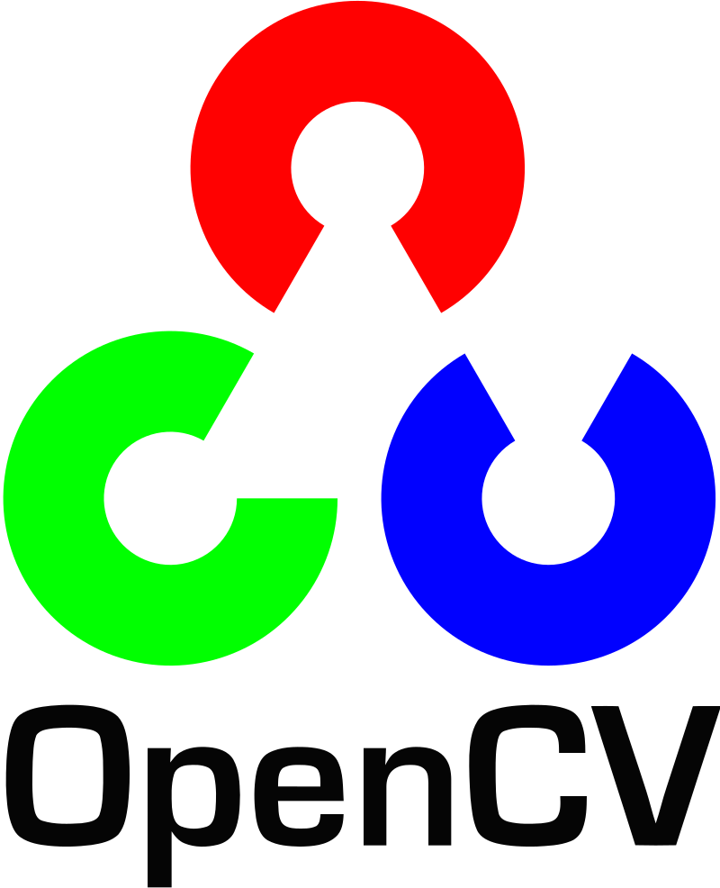
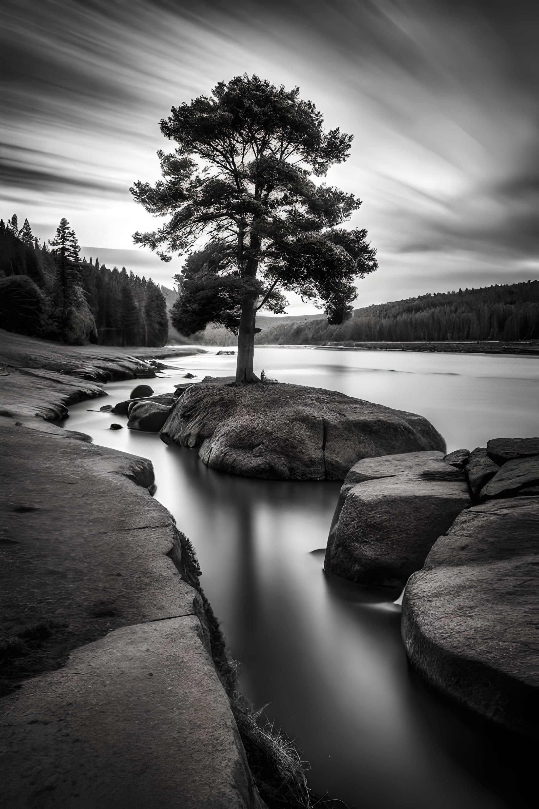
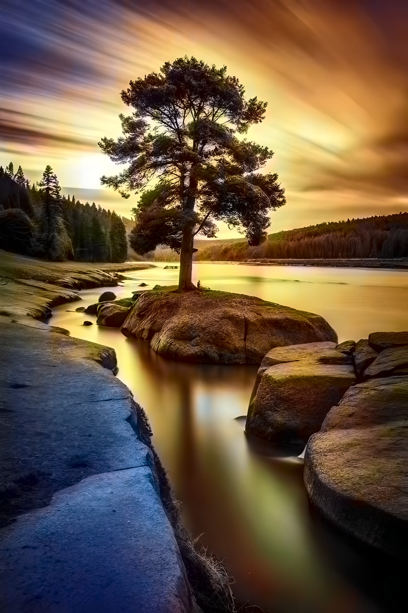
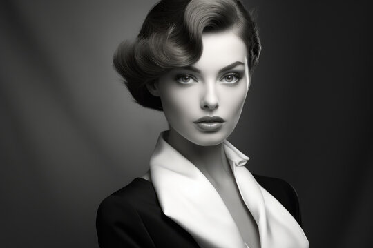
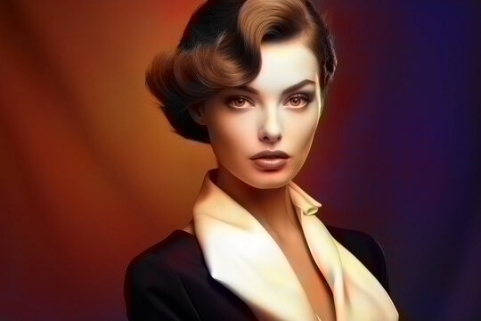

# 💻 AI Image Colorizer 🎨

## A comprehensive and easy to use black and white image colorizer using Deep Neural Networks and Flask frontend

<div align="center">
    
</div>

<div align="center" style="display: flex; justify-content:center; margin-top: 50px; margin-bottom: 50px;">
    
    
    
</div>

## Genesis of the idea

A few months ago I discovered some grayscale pictures of my relatives from the 20th century. I got the idea of colorizing them and bringing them to life to grasp what life was like back then. A few months ago, I used an online image colorizer and got the expected results. Nowadays, when I had to think of an idea for the CS50x Final Project, I thought that I should replicate what I had used. After researching on the internet for a short while I stumbled upon the OpenCV library and found that they made an open colorization model. That is how this idea gradually started becoming a reality.

## Results

<div align="center" style="display: flex; justify-content:center; margin-top: 50px; margin-bottom: 50px;">
    
    
</div>

<div align="center" style="display: flex; justify-content:center; margin-top: 50px; margin-bottom: 50px;">
    
    
</div>

## 🔖 Features

- **Upload a black and white image:** Easily upload any grayscale image for colorization.
- **Colorize a black and white image:** Use a pre-trained DNN to automatically add color to your images.
- **View and download the colorized image:** Instantly view the colorized image and download it for your records.

## ❗️ Disclaimer

The model performs exceptionally well with simpler objects like flowers or portraits with plain backgrounds. However, it may struggle with more complex scenes, leading to less accurate or unexpected colorization results.

## 🌐 Technologies used

- Python 3.12.5 as the base programming language
- NumPy for the neural network array calculation
- Open Computer Vision Library for the heavy lifting and image processing 
- Flask as the router and server
- HTML, CSS, Jinja

## 📋 The nn.py file

This is the backbone of the whole project, the nn.py file contains the colorize_image function which is responsible for BW to RGB conversion on a pre-trained DNN model. It uses the OpenCV python library and NumPy for the whole AI part of it. After imports it loads the model from files, initializes and configures the neural network for colorization as explained per the comments. After the initialization it reads the BW image using OpenCV and converts them into a format suitable for the DNN. The LAB color space is used because Neural Networks work much easier with that type of color space rather than RGB. The image is also resized to 224x224, the reason being that the model was trained on that type of data set and works best on it. After extracting the L channel, running the neural network and getting the A/B channels, afterward the color channels are combined with the Lightness channel. After that the whole image is converted from LAB to the BGR color space and the pixels are scaled back from the 0-1 values to full 0-255 RGB values. In summary, this was most of the heavy lifting of the whole project. After this part is done, the filename is generated via a UUID, the colorized image is saved and the filename is output for ease of use in other parts.

Artificial Intelligence is generally very hard to understand, so this was the hardest part of the project to comprehend. After the colorize_image function is done we proceed to the main.py where the actual flask runtime is located.

## 📋 The main.py file

In main.py Flask is declared with the allowed extensions that can be uploaded, and the code before the routes checks if the file upload is valid by separating the extension name from the rest of the file and checking if it compares with the allowed extensions. The "/" or "/home" method is simple, it fetches the uploaded file from the HTML form, checks if everything is alright as in if the file exists and if the filename is allowed. And then it proceeds to save the original image, pass it to the colorize_image function, save the output of the colorize_image function and pass it to the "/finished" route. Afterward, in the ‘/finished’ route, the image is fetched and displayed by passing it to the HTML via Jinja blocks. Another implementation on the "/finished" route is the ability to download the colorized image by fetching it from the server and sending it via flask's "send_file" function.

And that is it! I documented the project with comments that explain step by step what each function does and my colorization attemps have been quite successful so far so I am quite content with it.

## 💾 Steps to run

Clone the repository

```
git clone https://github.com/yourusername/ai-image-colorizer.git
cd ai-image-colorizer
```

Set up a venv - virtual environment:

```
python -m venv venv
source venv/bin/activate  # On Windows use `venv\Scripts\activate`
```

Install all the prerequisite packages (MacOS):

```
brew install python
pip3 install opencv-python numpy flask 
```

Run the app

```
python3 main.py
```

## Credits

Special thanks to [Rich Zhang](https://github.com/richzhang) for his exceptional pre-trained colorization model, and to the OpenCV team for their incredible tools and inspiration that made this project possible.